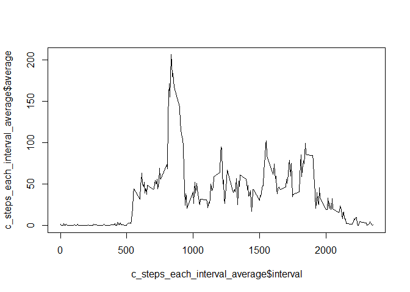
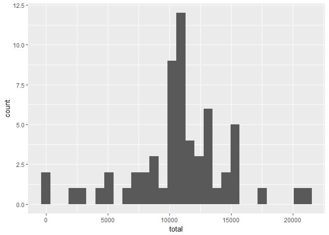
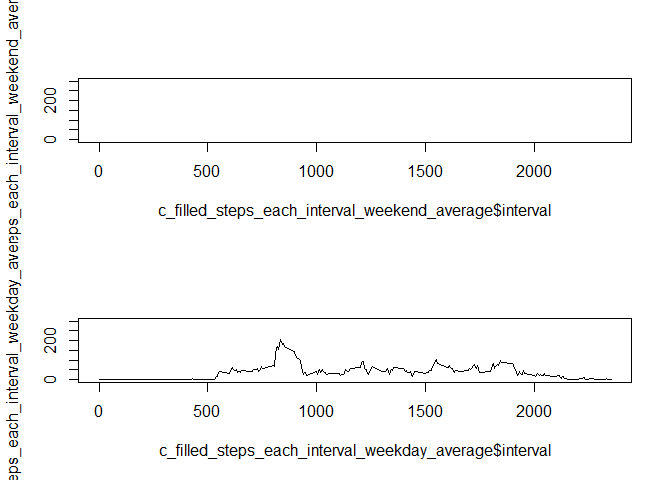

## Loading and preprocessing the data

```r
activity <- read.csv("activity.csv")
```

## What is mean total number of steps taken per day?
the total number of steps taken per day

```r
library(dplyr)
```

```
## 
## Attaching package: 'dplyr'
```

```
## The following objects are masked from 'package:stats':
## 
##     filter, lag
```

```
## The following objects are masked from 'package:base':
## 
##     intersect, setdiff, setequal, union
```

```r
library(ggplot2)
```

```
## Warning: package 'ggplot2' was built under R version 3.4.4
```

```r
steps_by_day <- group_by(activity, date)
c_steps_each_day_total <- summarise(steps_by_day, total = sum(steps, na.rm = T))
qplot(x = total, data = c_steps_each_day_total, geom = "histogram")
```

```
## `stat_bin()` using `bins = 30`. Pick better value with `binwidth`.
```

<!-- -->
`
the mean and median of the total number of steps taken per day are below

```r
c_steps_each_day_mean_median <- summarise(steps_by_day, mean = mean(steps, na.rm = T), median = median(steps, na.rm = T))
c_steps_each_day_mean_median
```

```
## # A tibble: 61 x 3
##    date          mean median
##    <fct>        <dbl>  <dbl>
##  1 2012-10-01 NaN        NA 
##  2 2012-10-02   0.438     0.
##  3 2012-10-03  39.4       0.
##  4 2012-10-04  42.1       0.
##  5 2012-10-05  46.2       0.
##  6 2012-10-06  53.5       0.
##  7 2012-10-07  38.2       0.
##  8 2012-10-08 NaN        NA 
##  9 2012-10-09  44.5       0.
## 10 2012-10-10  34.4       0.
## # ... with 51 more rows
```


## What is the average daily activity pattern?
The time series gragh is below.

```r
steps_by_interval <- group_by(activity, interval)
c_steps_each_interval_average <- summarise(steps_by_interval, average = mean(steps, na.rm = T))
plot(c_steps_each_interval_average$interval, c_steps_each_interval_average$average, type = 'l')
```

<!-- -->

```r
interval_index_with_max_steps <- which.max(c_steps_each_interval_average$average)
interval_with_max_steps <- c_steps_each_interval_average[[interval_index_with_max_steps, "interval"]]
```

The 5-minute interval, which contains the maximum number of steps, is 835

## Imputing missing values


```r
na_rows_sum <- sum(rowSums(is.na(activity)))
```

The total number of missing values in the dataset is 2304.


```r
na_rows_index <- which(is.na(activity$steps))
filled_data <- activity
for (i in na_rows_index) {
  filled_data$steps[i] <- c_steps_each_interval_average[[which(activity[[i, "interval"]] == c_steps_each_interval_average$interval) , "average"]]
}

filled_steps_by_day <- group_by(filled_data, date)
c_filled_steps_each_day_total <- summarise(filled_steps_by_day, total = sum(steps, na.rm = T))
qplot(x = total, data = c_filled_steps_each_day_total, geom = "histogram")
```

```
## `stat_bin()` using `bins = 30`. Pick better value with `binwidth`.
```

<!-- -->

```r
c_filled_steps_each_day_mean_median <- summarise(filled_steps_by_day, mean = mean(steps, na.rm = T), median = median(steps, na.rm = T))
c_filled_steps_each_day_mean_median
```

```
## # A tibble: 61 x 3
##    date         mean median
##    <fct>       <dbl>  <dbl>
##  1 2012-10-01 37.4     34.1
##  2 2012-10-02  0.438    0. 
##  3 2012-10-03 39.4      0. 
##  4 2012-10-04 42.1      0. 
##  5 2012-10-05 46.2      0. 
##  6 2012-10-06 53.5      0. 
##  7 2012-10-07 38.2      0. 
##  8 2012-10-08 37.4     34.1
##  9 2012-10-09 44.5      0. 
## 10 2012-10-10 34.4      0. 
## # ... with 51 more rows
```

We can see that these values differ from the estimates from the first part of the assignment.
The impact of imputing missing data on the estimates of the total daily number of steps is that it changes NA to average number so that the height of the bin in the middle increase.

## Are there differences in activity patterns between weekdays and weekends?


```r
filled_data$date <- as.Date(filled_data$date)
week_day <- weekdays(filled_data$date, abbreviate = T)
filled_data <- mutate(filled_data, weekend = as.factor(week_day %in% c("Sat", "Sun")))
#, labels = c("weekend", "weekday")
filled_steps_by_interval <- group_by(filled_data, interval)
c_filled_steps_each_interval_weekend_average <- summarise(subset(filled_steps_by_interval, weekend == T), average = mean(steps, na.rm = T))
c_filled_steps_each_interval_weekday_average <- summarise(subset(filled_steps_by_interval, weekend == F), average = mean(steps, na.rm = T))
par(mfrow = c(2, 1))
plot(c_filled_steps_each_interval_weekend_average$interval, c_filled_steps_each_interval_weekend_average$average, type = 'l', xlim = c(0, 2355), ylim = c(0, 300))
plot(c_filled_steps_each_interval_weekday_average$interval, c_filled_steps_each_interval_weekday_average$average, type = 'l', xlim = c(0, 2355), ylim = c(0, 300))
```

<!-- -->

